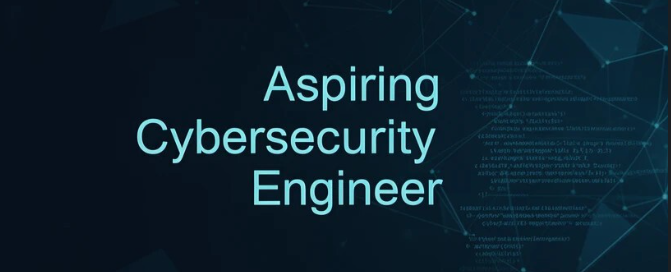

  

<h1 align="center">
  Hi, I'm <a href="https://github.com/AhmedElkadeem0">Ahmed Elkadeem</a>
  
</h1>

  

 

---

<h1>About Me! 😎</h1>

- 🎓 &nbsp; CS Student at **Egypt-Japan University of Science and Technology (E-JUST)** — Specializing in **Cybersecurity**
- 🔭 &nbsp; Currently building a **Raspberry Pi 5 IoT project** and a **RAG (AI) pipeline** using LangChain & FAISS
- 🌱 &nbsp; Currently learning **Flutter**, **FastAPI**, and **IoT systems**
- 💬 &nbsp; Ask me about **Python**, **Flask**, **Cybersecurity**, or **Embedded Systems**
- 🛡️ &nbsp; Passionate about writing **secure, clean, and efficient code**
- 😄 &nbsp; Pronouns: He/Him
- ⚡ &nbsp; Fun fact: I play football, hit the gym, and grind ranked in Valorant — all between debugging sessions ⚽🏋️‍♂️🎮

 

 

<h1 align="center">Get in Touch! 📬</h1>
 

  
  &nbsp;&nbsp;&nbsp;
  
  &nbsp;&nbsp;&nbsp;
  

 

 

<h2>🛠️ My Skills</h2>

### 👉 Programming Languages

  
  &emsp;
  
  &emsp;
  
  &emsp;
  

### 👉 Frameworks & Libraries

  
  &emsp;
  
  &emsp;
  
  &emsp;
  
  &emsp;
  

### 👉 Databases

  
  &emsp;
  

### 👉 Cybersecurity & Embedded

  
  &emsp;
  
  &emsp;
  
  &emsp;
  

### 👉 Tools & Platforms

  
  &emsp;
  
  &emsp;
  
  &emsp;
  
  &emsp;
  
  &emsp;
  

 

 

<h1>Some of My Projects! 🎨</h1>
 

 

 

<h1>Certifications! 🏆</h1>
 

|  |  |  |
|---|---|---|
|  |  |  |

 

 

<h1>GitHub Stats! 📊</h1>
 

 

 

<h1 align="center">Thank You for Visiting! 🤵</h1>

  

---

*Last updated: 2026*
